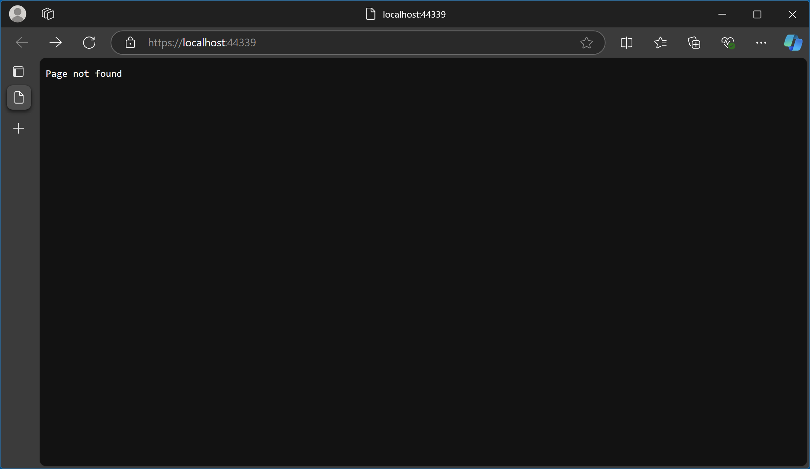
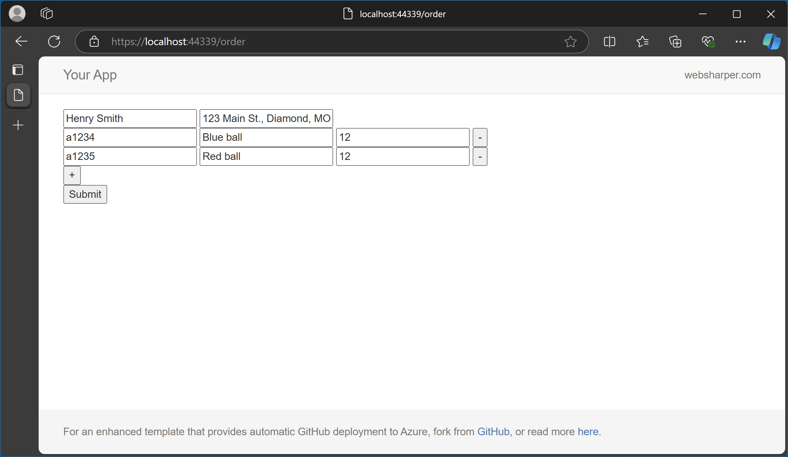
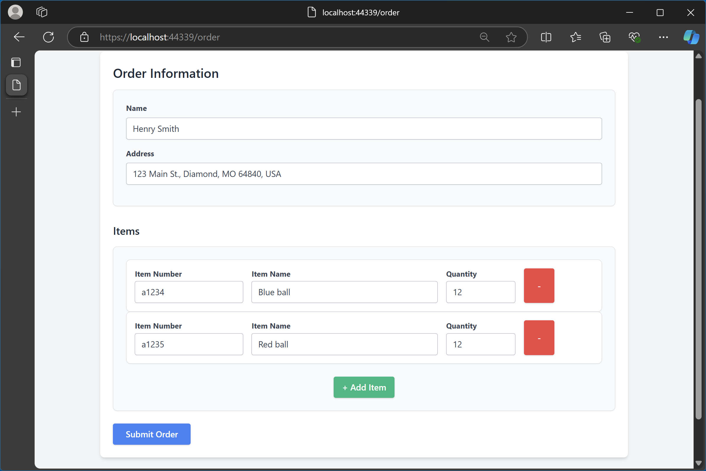

# IntelliFactory Synth UI sample application

This application has been created by a ChatGPT model trained to output WebSharper code for a simple DSL for declaring basic UIs such as web forms.

The DSL text used was the following:

```text
Item(ItemNumber: string; Name: string; Quantity: int)
Order(Name: string; Address: string; Items: Item list)
OrderPage: Order;
```

The key idea in this first stage (ca. 2020) is automating the generation of web forms and externalizing their entire UI into designer templates, requiring no recompilation on template changes. This is accomplised using the **abstract form** concept from [WebSharper.Forms](https://github.com/dotnet-websharper/forms) and using [WebSharper.UI templating](https://developers.websharper.com/docs/v4.x/fs/ui#heading-8).

You can read more about the motivations in this 2020 IntelliFactory research paper [^1]:

> Granicz, Adam, Uri, Jozsef, Janko, Andras. **Synthesizing user interfaces using functional reactive web abstractions**. In Programming 2020: Companion Proceedings of the 4th International Conference on Art, Science, and Engineering of Programming. Pages 84-89. 


## How to run this app

First, make sure you have added the WebSharper NuGet feed to your nuget sources:

```
dotnet nuget add source https://nuget.pkg.github.com/dotnet-websharper/index.json --name dotnet-websharper-GitHub --username <GH_USER> --password <PAT>
```

... where `<GH_USER>` is your GitHub username, and `<PAT>` is your Personal Access Token for your GitHub account.

You can run the project from Visual Studio (Ctrl+F5) or from the command line (`dotnet run`).

Don't be alarmed to see a 404 when you start the app - this is normal, because there is nothing responding at the root of the app:



Simply navigate to the order page at `/order`:



At this point, you can try replacing the UI entirely by copying your own designer template over `Main.html`. To facilitate this, feel free to use `Main-designed.html` (and you can always revert by restoring the original from `Main-orig.html`), which is a simple design generated by ChatGPT using Tailwind. Once you overwrite `Main.html` with it and refreshed the page, you should see:




## DSL and semantics

While the concrete syntax of the DSL used for code generation can easily be changed, even to the description below, the sample DSL input snippet above can be read as follows:

```text
Define a form to collect Items, where each Item has an ItemNumber, a Name, and a numeric Quantity.

Define a form to collect Orders, where each Order has a Name, an Address, and Items - a list of Item values.

Declare OrderPage to collect an Order.
```

What this is meant to convey is that the user wants a web page to collect orders, where each order contains items and other data.

Nothing stops the user from declaring multiple pages, and each such declaration will generate a sitelet endpoint to collect the corresponding entity.

## Notes on code generation

Each form declaration generates model types in `Model.fs`, along with WebSharper.Forms abstract forms. Forms that surface as pages get a Submit button and an endpoint in the `EndPoint` type.

We also generate actual form functions in `UI.fs`, that use the abstract forms and add a renderer that uses WebSharper UI templating.

For each page, we output a function in `Client.fs`, fabricate some seed data, call the actual renderer from above, and print the return data (remember, we have a submit button) on the JavaScript console. The code we output differentiates between rendering on the server vs on the client, leaving it to you to customize server-side rendering if needed (pulse animation, etc.) Remember, the actual form lights up on the client after page load.

Finally, we create a sitelet in `Site.fs` and generate an HTML page for each page using our master template (`Main.html`) as the base and hydrate the corresponding form component into its `Body` placeholder.

### Template requirements

Note, that the above semantics requires that the master HTML template contains an inner template for each form used, with placeholders matching the declared field names. It also must have an `XXX_Add` placeholder for each `XXX` collection field (such as `Items` above) where we render the "add" widget to manage that collection. The template for this widget is assumed be `<Form>Template_XXX_Add`.

Similarly, the "remove" widget is assumed to be available as an inner template `<Form>Template_Remove`, along with a `Remove` placeholder on the item template.

The add and remove widget templates must have an `Add` and `Remove` event handler, respectively. The generated code populates these with the add/remove logic.


[^1]: https://dl.acm.org/doi/10.1145/3397537.3397554
